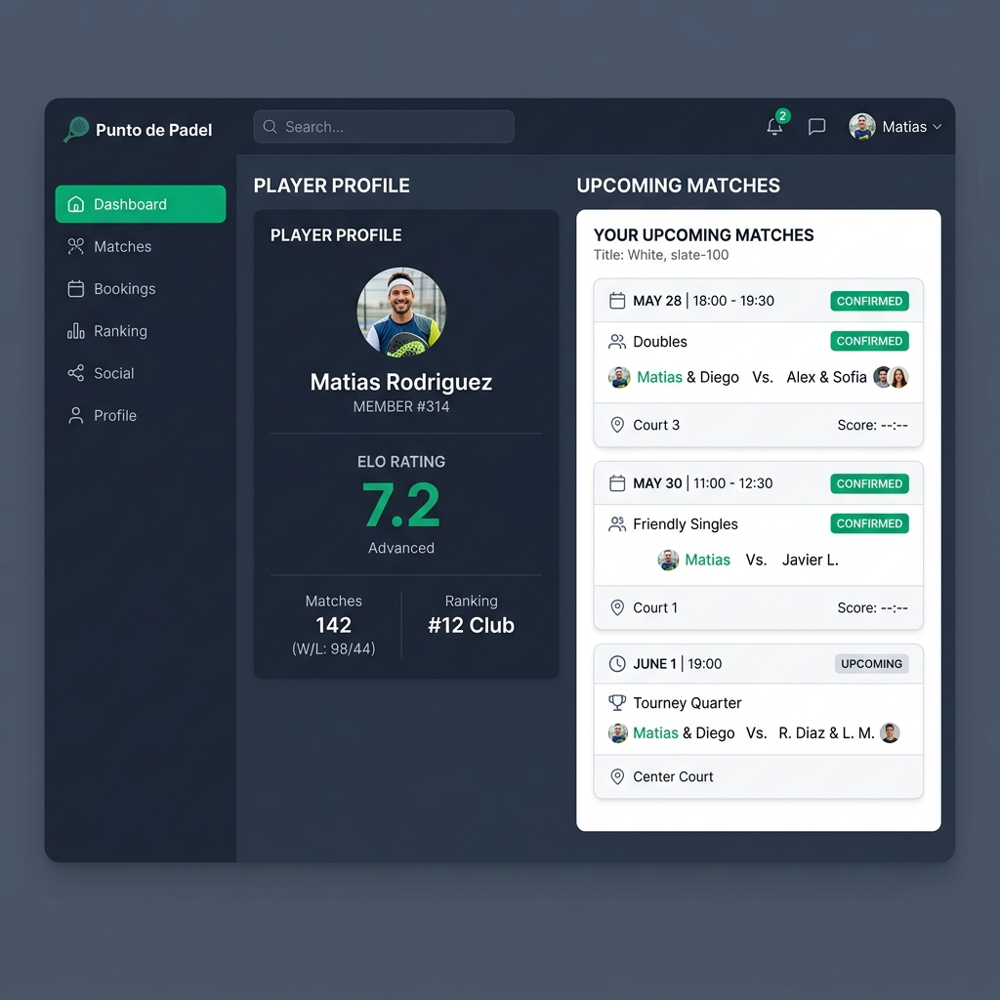
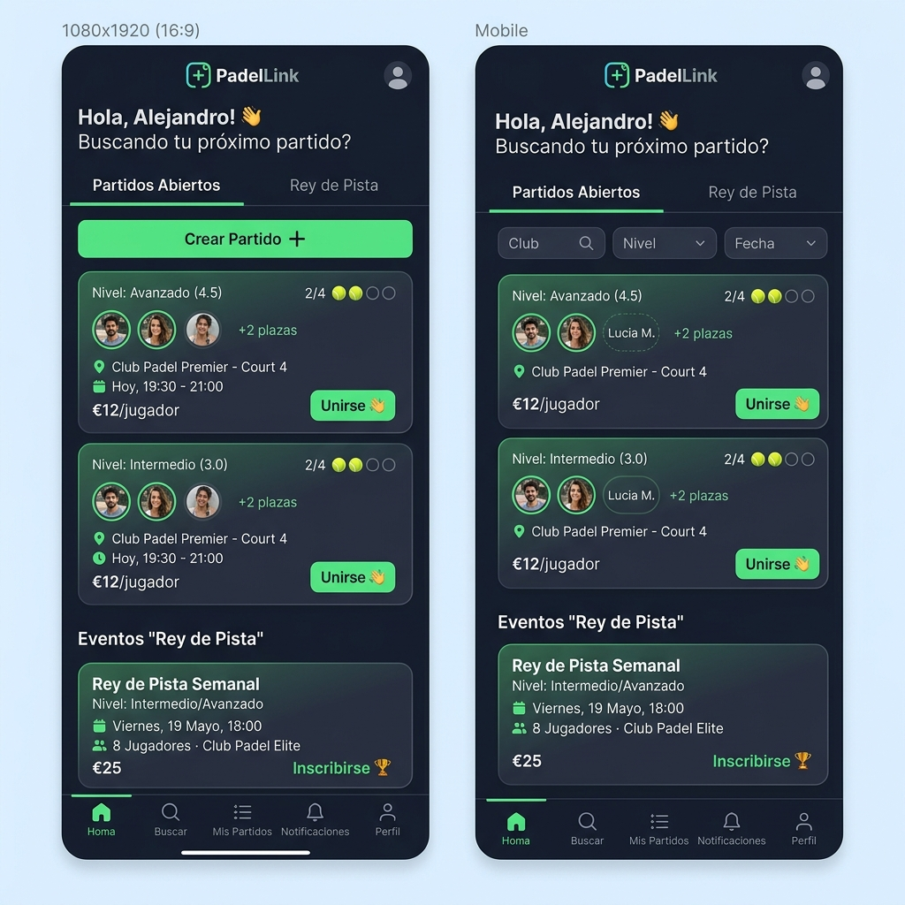

# 🎾 Punto de Padel

Plataforma web para comunidades de pádel: registra partidos con tus amigos, sube de nivel con un ranking ELO dinámico (0-10) y compite en torneos.

**Demo:** https://appweb-padel.vercel.app

<div align="center">
  
  
</div>

## ✨ Funcionalidades

- **📈 Ranking ELO dinámico**: Los jugadores ganan o pierden puntos según victorias/derrotas y nivel del rival.
- **🎾 Partidos Abiertos**: Crea y únete a partidos públicos o privados filtrando por nivel y fecha.
- **👑 Modo "Rey de Pista"**: Modalidad para 6-12 jugadores con rotaciones continuas y puntuación acumulada.
- **🏆 Torneos**: Apúntate a competiciones organizadas por el club, con brackets y clasificación en tiempo real.
- **🔔 Amigos y Notificaciones**: Chat directo e invitaciones a partidos con un solo clic desde WhatsApp.
- **⚡ Auto-inscripción por enlace**: Los jugadores se unen a una pista directamente desde un link compartido.

## 🛠️ Tecnologías

- **Framework**: [Next.js 16](https://nextjs.org/) (App Router, Server Actions)
- **Base de datos & Auth**: [Supabase](https://supabase.com/) (PostgreSQL, Auth, Realtime)
- **Estilos**: [Tailwind CSS v4](https://tailwindcss.com/)
- **Despliegue**: [Vercel](https://vercel.com/)

## 🚀 Ejecutar en local

```bash
git clone https://github.com/urse3/Padel.git
cd Padel
npm install
```

Crea `.env.local` con tus credenciales de Supabase:
```env
NEXT_PUBLIC_SUPABASE_URL=https://tu-proyecto.supabase.co
NEXT_PUBLIC_SUPABASE_ANON_KEY=tu-anon-key-publica
```

```bash
npm run dev
```

Abre [http://localhost:3000](http://localhost:3000).

## 📦 Despliegue

Optimizado para Vercel. Usa `proxy.ts` (estándar de Next.js 16) en lugar del antiguo `middleware.ts`.

El repositorio incluye un **GitHub Actions workflow** (`.github/workflows/keepalive.yml`) que hace un ping a la API de Supabase cada 2 días para evitar que el plan gratuito pause la base de datos. Requiere los secretos `SUPABASE_URL` y `SUPABASE_ANON_KEY` en Settings → Secrets → Actions.

## 📄 Estado

Proyecto personal en evolución. Desarrollado con ayuda de herramientas de IA.
